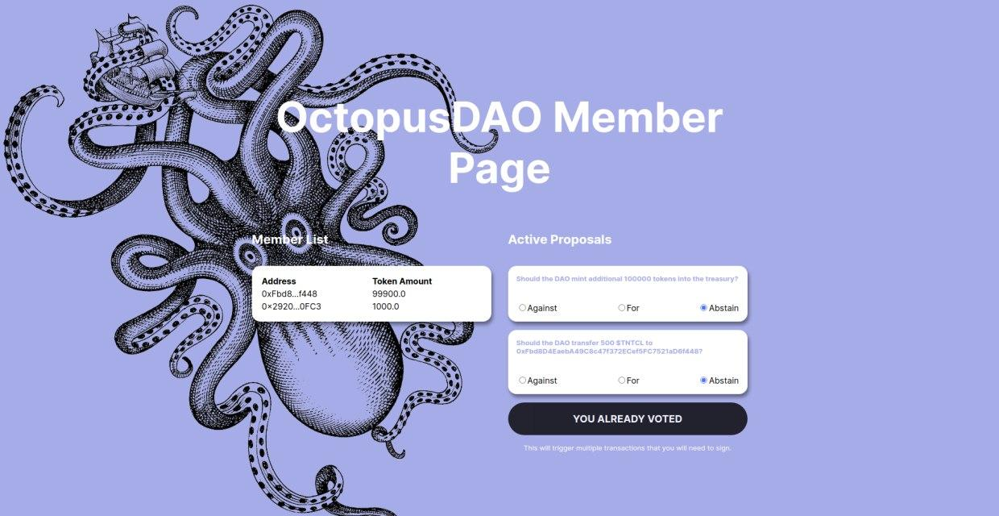

# OctopusDAO

OctopusDAO is a project built using JS, React, and the Thirdweb sdk.

Currently deployed to Rinkeby network.

Users can claim their membership NFTs after connecting with their wallet.
The NFT in turn allows the users to vote on proposals and take part in the governance of DAO.

# local setup
1. Run `npm install` at the root of your directory
2. Run `npm start` to start the project